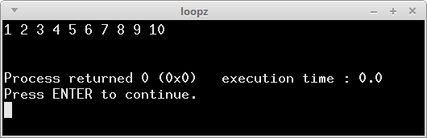
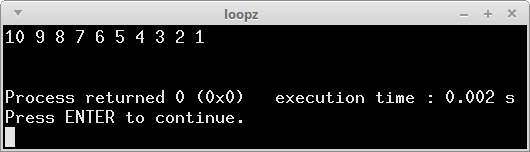
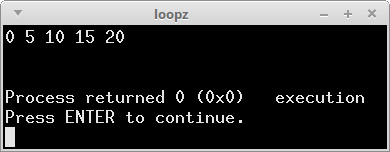
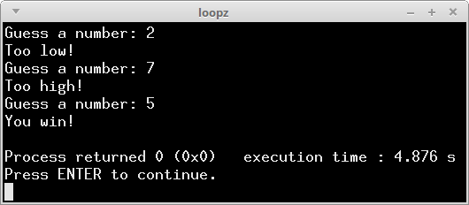
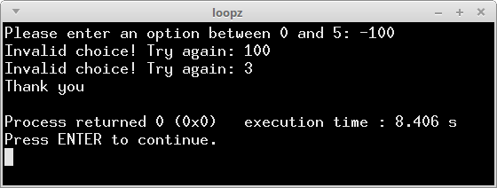

# CS 200 Lab 3: While Loops

## Introduction

There are five problems to solve that use while loops below.
You can either implement these all in the same file,
or separate source files.

## Review

* While Loops
* If Statements
* Input (cin) and Output (cout)

---

## Problem 1: 1 through 10

You will use a while loop to display a list of numbers between 1 and 10, increasing.

1. Create an integer variable called **countUp** and initialize it to 1.

2. Create a while loop. It should loop while **countUp** is less than 11.
Inside the while loop...

	1. Display the current value of **countUp** with a cout statement.
	
	2. Increment the value of **countUp** by one.
	
3. Once the loop has completed, display the message "done!" with cout.

### Sample Output

## Problem 2: 10 through 1

You will use a while loop to display a list of numbers between 10 and 1, decreasing.

1. Create a variable called **countDown** and initialize it to 10.

2. Create a while loop. It should loop while **countDown** is greater than 0.
Inside the while loop...

	1. Display the current value of **countDown** with a cout statement.
	
	2. Increment the value of **countDown** by one.
	
3. One the loop has completed, display the message "done!" with cout.

### Sample Output

## Problem 3

You will use a while loop to display a list of numbers between 0 and 20,
increasing by 5 each time.

1. Create a variable called **counter** and initialize it to 0.

2. Create a while loop. It should loop while **counter** is less than or equal to 20.
Within the while loop...

	1. Display the current value of **counter** with a cout statement.
	
	2. Increment the value of **counter** by 5. (Add 5 to it).

3. Once the loop has completed, display the message "done!" with cout.

### Sample Output

## Problem 4

Write a number-guesser game. The user will continue to guess numbers
until they get it right.
We will use a while loop to have the program keep asking the player for a guess,
until they finally get it right.

For this one, you will need a do-while loop. These look like:

	do
	{
		// code to execute
	} while ( condition );
	
And they are guaranteed to run the internal code *at least once*.

1. Create an integer variable called **secretNumber**, and set it to
your favorite number.

2. Create another integer variable called **playerGuess**. It does not need to be initialized.

3. Create a **do-while** loop. Inside the loop:
	
	1. Display a message to the user, asking them to enter a number guess. (cout)
	
	2. Get the player's guess and store it in the **playerGuess** variable. (cin)
	
	3. Compare the **playerGuess** value to the **secretNumber** value...
	
		1. If playerGuess is less than secretNumber, display the message "too low!"
		
		2. Otherwise, if playerGuess is greater than secretNumber, display the message "too high!"
		
4. At the end of the do-while loop you will put the condition for looping.
Make the condition: while playerGuess is not equal to secretNumber.

5. Outside the do-while loop, display the message "You win!" - this is displayed
once the loop is "escaped", which only happens once the player has 
correctly guessed the number.

### Sample Output

## Problem 5

Write a program that will act as an "input validator" for user input.
Basically, it expects the input to be between a certain range,
and if it is not, it requires the user to re-enter their choice.

1. Display a message that says "Please enter a number between 0 and 5."

2. Create a variable called **choice**, which is an integer.

3. Use cin to get the user's input and store it in **choice**.

4. Create a while loop. While **choice** is either
less than 0 or greater than 5...

	1. Display the message "invalid entry. Try again:"
	
	2. Get the user's input again (with cin) and store it in **choice**.

5. Outside of the loop, display the message "Thank you".

### Sample Output

