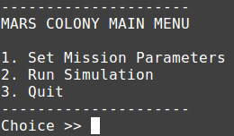
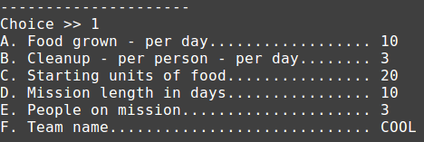
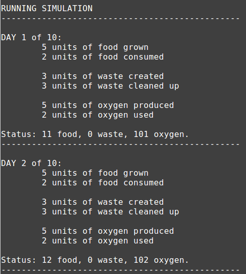
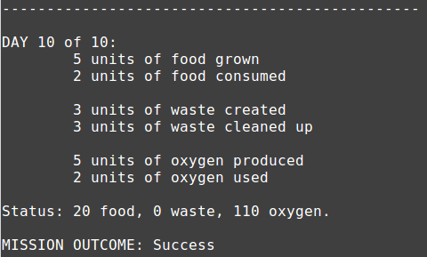
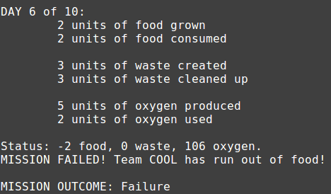

# CS 200 Lab 4: Mars Experiment

## Introduction

This lab is meant to review content leading up to this week,
and it is meant to be done in a team.

In the program, you will be setting up a simulation of astronauts
on mars. The person running the program will set mission parameters such
as the team size, amount of food grown per day, and more.

Then, running the simulation will go through each day,
adjust the supply levels, and display the status.

## Review

* While Loops
* If Statements
* Input (cin) and Output (cout)
* Variables

## Turn-in

Make sure to upload all your source files (.cpp) to the Dropbox.

**Add the name of all people in your team in the upload comments**.

---

## Part 1: Creating the variables

Start off with your standard C++ program base:

	#include <iostream>
	#include <string>
	using namespace std;

	int main()
	{
		return 0;
	}
	
The following variables will need to be declared before
the program loop begins:

<table>
	<tr>
		<th>Variable Name</th>
		<th>Data Type</th>
		<th>Initial Value</th>
		<th>Constant?</th>
		<th>Description</th>
	</tr>
	
	<tr>
		<td>done</td>
		<td>boolean</td>
		<td>false</td>
		<td>no</td>
		<td>This is the flag to let the program loop know when to quit</td>
	</tr>
	
	<tr>
		<td>foodConsumed_PerPersonPerDay</td>
		<td>integer</td>
		<td>2</td>
		<td><strong>yes</strong></td>
		<td>This is amount of food consumed (per person) per day</td>
	</tr>
	
	<tr>
		<td>oxygenCreated_PerDay</td>
		<td>integer</td>
		<td>5</td>
		<td><strong>yes</strong></td>
		<td>This is amount of oxygen created per day</td>
	</tr>
	
	<tr>
		<td>wasteCreated_PerPersonPerDay</td>
		<td>integer</td>
		<td>3</td>
		<td><strong>yes</strong></td>
		<td>This is the amount of waste created (per person) per day</td>
	</tr>
	
	<tr>
		<td>oxygenUsed_PerPersonPerDay</td>
		<td>integer</td>
		<td>2</td>
		<td><strong>yes</strong></td>
		<td>This is the amount of oxygen consumed (per person) per day</td>
	</tr>
	
	<tr>
		<td>foodGrown_PerDay</td>
		<td>integer</td>
		<td></td>
		<td>no</td>
		<td>This is the amount of food grown per day</td>
	</tr>
	
	<tr>
		<td>cleanup_PerPersonPerDay</td>
		<td>integer</td>
		<td></td>
		<td>no</td>
		<td>This is the amount of cleanup done (per person) per day</td>
	</tr>
	
	<tr>
		<td>foodCount</td>
		<td>integer</td>
		<td></td>
		<td>no</td>
		<td>This is the amount of food the team has, which will change each day</td>
	</tr>
	
	<tr>
		<td>wasteCount</td>
		<td>integer</td>
		<td></td>
		<td>no</td>
		<td>This is the amount of waste the team has, which will change each day</td>
	</tr>
	
	<tr>
		<td>oxygenCount</td>
		<td>integer</td>
		<td></td>
		<td>no</td>
		<td>This is the amount of oxygen the team has, which will change each day</td>
	</tr>
	
	<tr>
		<td>peopleCount</td>
		<td>integer</td>
		<td></td>
		<td>no</td>
		<td>This is the amount of people on the team</td>
	</tr>
	
	<tr>
		<td>missionLength</td>
		<td>integer</td>
		<td></td>
		<td>no</td>
		<td>This is the amount of days the mission will run</td>
	</tr>
	
	<tr>
		<td>teamName</td>
		<td>string</td>
		<td></td>
		<td>no</td>
		<td>This is the name of the team - ONE WORD ONLY.</td>
	</tr>
</table>

### Const Variables

Variables declared as **const** (constant) cannot be changed during the
program, and must be initialized immediately upon declaration.

Example:

	const int myNumber = 5;

### All these variables!

Some of these variables are constants, because the amount of oxygen used per person
will remain constant, while the user running the program has control over
rates such as waste cleaned up per day or food grown per day.

## 2. Creating the program loop & main menu

Next, you will need to create the main program loop. The main menu
will show a list of options: 

1. Set Mission Parameters
2. Run Simulation
3. Quit

Display this menu, then create an **integer variable called "choice"**.

Get the user input and store it in **choice** (with cin), then
you will use an if / else if statement to choose what feature to run.

For now, just implement the logic for 3.
For option 3, set the **done** flag to **true**.

### Write & Test

Write the main menu. For choices 1 and 2, add a **placeholder** label that just says
"Mission Parameters" or "Run Simulation" if these options are chosen.

After putting in these placeholders and functionality, build and run the program.
Make sure that the placeholder labels show up when selecting 1 or 2, and make sure
the program quits when choosing 3. Continue after testing.

## 3. Setting mission parameters

In the **Setup mission parameters** part of the program, you will
ask the user to input four parameters:

1. Food grown per day
2. Cleanup per person per day
3. Starting units of food
4. Mission length, in days
5. People on the mission
6. Team name

### Write & Test

To test out this functionality, immediately after having the user enter
the parameters, write them back out to the user with this code:

	// Test code
	cout << "foodGrown_PerDay: " << foodGrown_PerDay << endl;
	cout << "cleanup_PerPersonPerDay: " << cleanup_PerPersonPerDay << endl;
	cout << "foodCount: " << foodCount << endl;
	cout << "missionLength: " << missionLength << endl;
	cout << "peopleCount: " << peopleCount << endl;
	cout << "teamName: " << teamName << endl;

Build and run, make sure what the user inputted is displayed properly.
If there are any logic errors, make sure you catch them before continuing.

## 4. Setting up the Simulation

Finally, during the simulation we will use a while loop to go through
each day, one step at a time, and display the stats for each.

We will be adjusting the supply amounts and checking to make sure nothing
bad hapens, and then display the result of the simulation - failure or success.

Before we start the **simulation loop**, we need to set up
the simulation. Do the following:

1. Create an integer variable called **day** and set it to 1.
2. Set oxygenCount to 100.
3. Set wasteCount to 0.
4. Create a variable called **missionSuccess** which is a boolean, and initialize it to true.
5. Display a message to the user: "Running simulation".

Now we can create the while loop.

## 5. Running the simulation

After setting up the variables, you will start the simulation loop.

Create a while loop that will continue looping **while the current day (day) is less than or equal to the mission length (missionLength)**.

Within the loop:

1. Display the **rates**:

	1. Display the current **day**.

	2. Display the units of food grown (foodGrown_PerDay)

	3. Display the units of food consumed (foodConsumed_PerPersonPerDay)

	4. Display the units of waste created (wasteCreated_PerPersonPerDay)

	5. Display the units of cleanup created (cleanup_PerPersonPerDay)

	6. Display the units of oxygen created (oxygenCreated_PerDay)

	7. Display the units of oxygen used (oxygenUsed_PerPersonPerDay)

2. Adjust the **current supplies**:

	1. for **foodCount**:
		
		1. Add foodGrown_PerDay
		
		2. Subtract ( foodConsumed_PerPersonPerDay * peopleCount )
		
	2. for **wasteCount**:
		
		1. Add ( wasteCreated_PerPersonPerDay * peopleCount )
		
		2. Subtract ( cleanup_PerPersonPerDay * peopleCount )
	
	3. for **oxygenCount**:
		
		1. Add oxygenCreated_PerDay
		
		2. Subtract ( oxygenUsed_PerPersonPerDay * peopleCount )

3. Display the **amount of supplies today**: foodCount, wasteCount, and oxygenCount.

4. Check to see if any supplies have been depleted. Note that these are each separate if statements (not if / else if):

	1. if foodCount is less than 0, then the mission failed. Display a message, set missionSuccess to false, and break out of the while loop.
	
	2. if wasteCount is more than 20, then the mission failed. Display a message, set missionSuccess to false, and break out of the while loop.
	
	3. if oxygenCount is less than 0, then the mission failed. Display a message, set missionSuccess to false, and break out of the while loop.
	
5. Finally, at the end of while loop, add 1 to the **day** variable.

### While Loop Aftermath

Immediately after the **simulation loop**, you should check to see whether the
mission was a success or a failure.

Use an if statement and look at **missionSuccess*. If it is true,
display a message that the mission was a success.

Otherwise, display a message that the mission was a failure.

---

## Sample Output

**Main Menu**

**Mission parameter setup**

**Mission start**

**Mission success**

**Mission failure**

---

